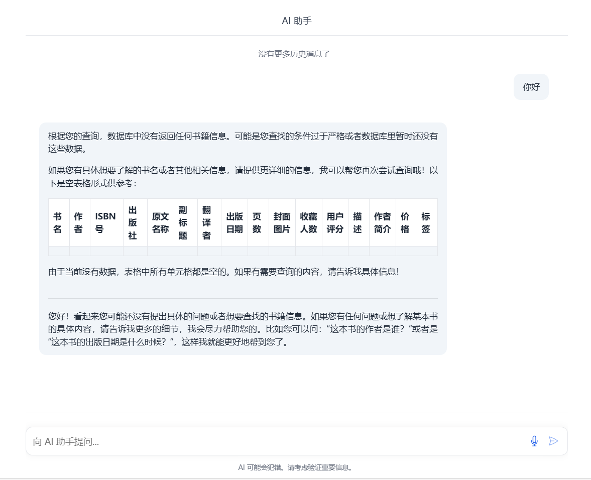
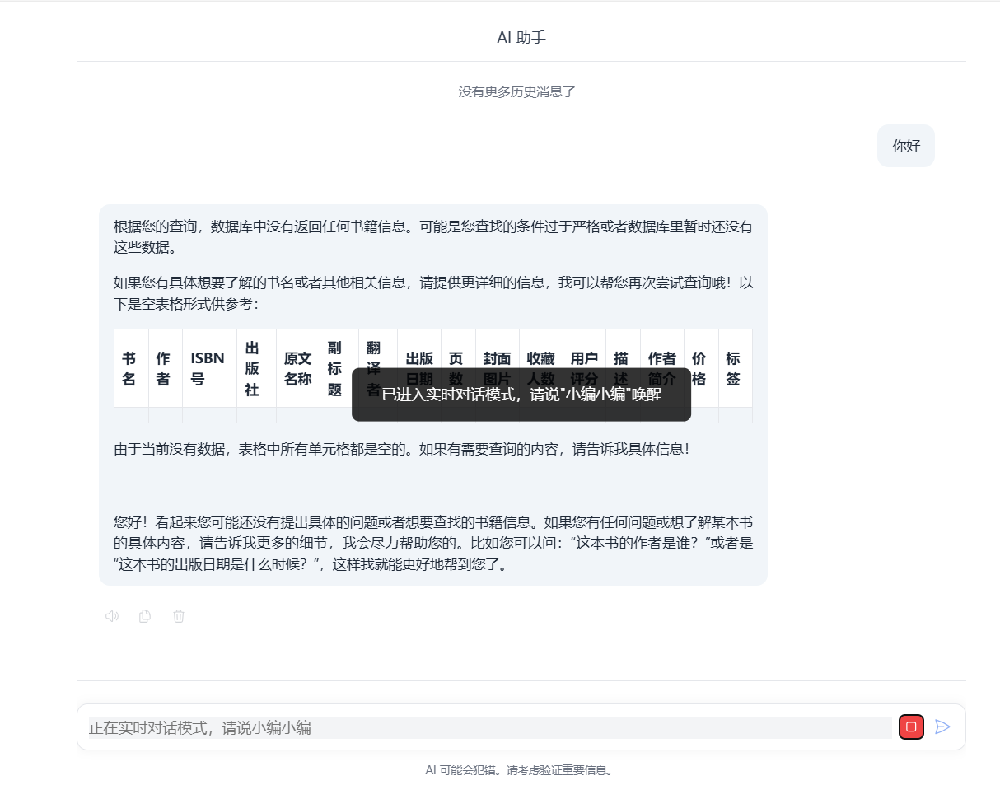

# 文轩项目前端

## 界面



实时对话模式说出唤醒词**小编小编**即可实时语音输入：



## 主要模块

1. **聊天界面模块**（ChatWindow.vue）
   - 消息展示
   - 消息输入
   - 历史记录加载
   - 消息操作（复制、删除、语音播放）
   - 打字机效果
2. **实时对话模块**（RealTimeChat.vue）
   - 语音识别
   - 语音录制
   - 语音转文字
   - 唤醒词检测
3. **布局模块**（App.vue）
   - 整体布局
   - 响应式设计
   - 主题样式定义

## 使用的技术

1. **前端框架**
   - Vue 3
   - Composition API
   - Vite 构建工具
2. **UI/UX**
   - CSS3 动画效果
   - Flexbox 布局
   - HeroIcons 图标库
   - 自定义滚动条样式
   - 响应式设计
3. **API 集成**
   - Axios 进行 HTTP 请求
   - FormData 处理
   - WebSocket
4. **语音相关**
   - Web Speech API（语音识别）
   - MediaRecorder API（录音）
   - AudioContext（音频处理）
5. **Markdown 处理**
   - marked 库解析 Markdown
   - 自定义 Markdown 样式
6. **功能特性**
   - 实时语音识别
   - 语音转文字（STT）
   - 文字转语音（TTS）
   - 消息历史记录
   - 复制功能
   - 临时提示（Toast）
7. **开发工具**
   - 代理配置（Vite）
   - 开发环境配置
   - 错误处理机制
8. **后端接口**
   - `/chat` - 聊天接口
   - `/stt` - 语音转文字
   - `/tts` - 文字转语音
   - `/conversations` - 历史记录
   - `/delete/:conversationId` - 删除对话

启动项目时，转到项目目录，然后使用下面的命令：

```bash
npm install
npm run dev
```

